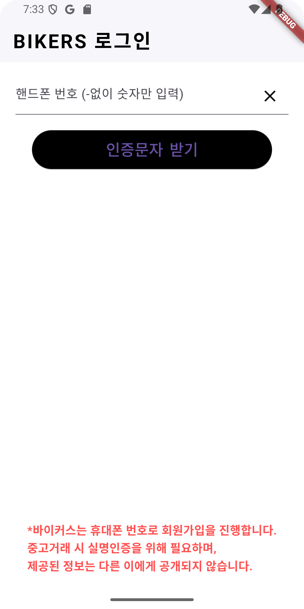
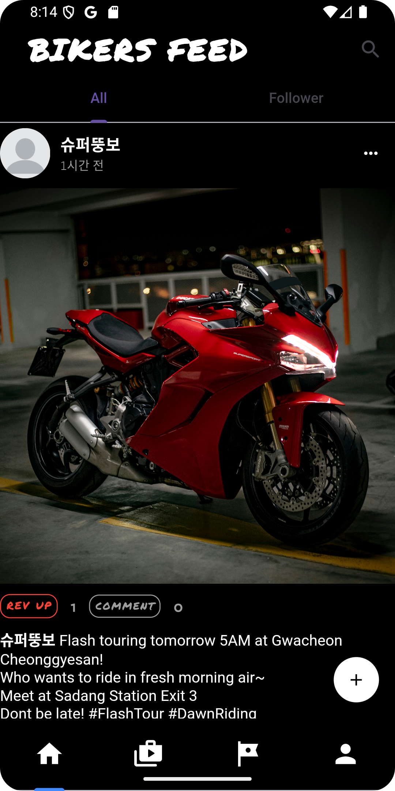
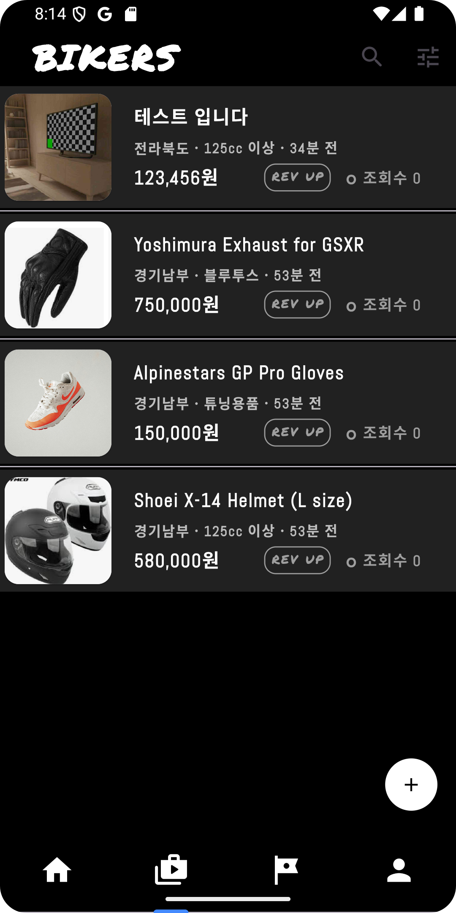
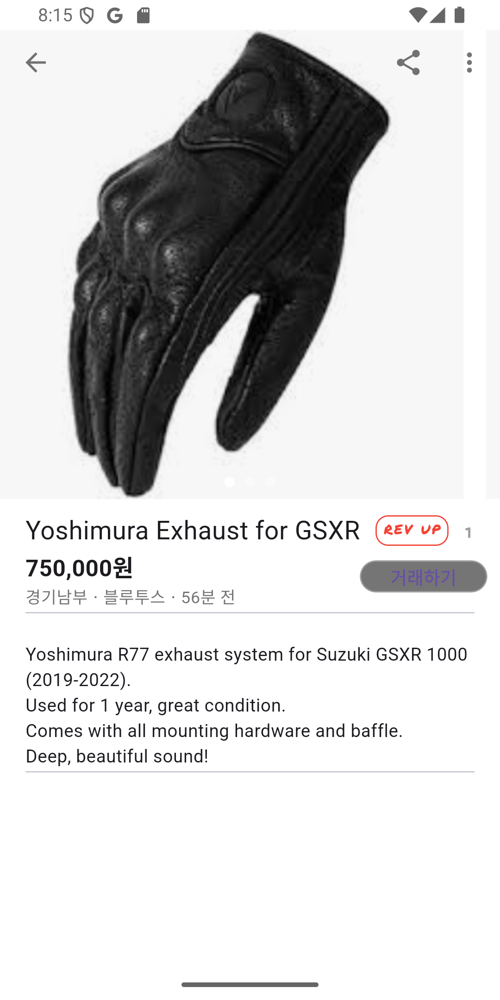
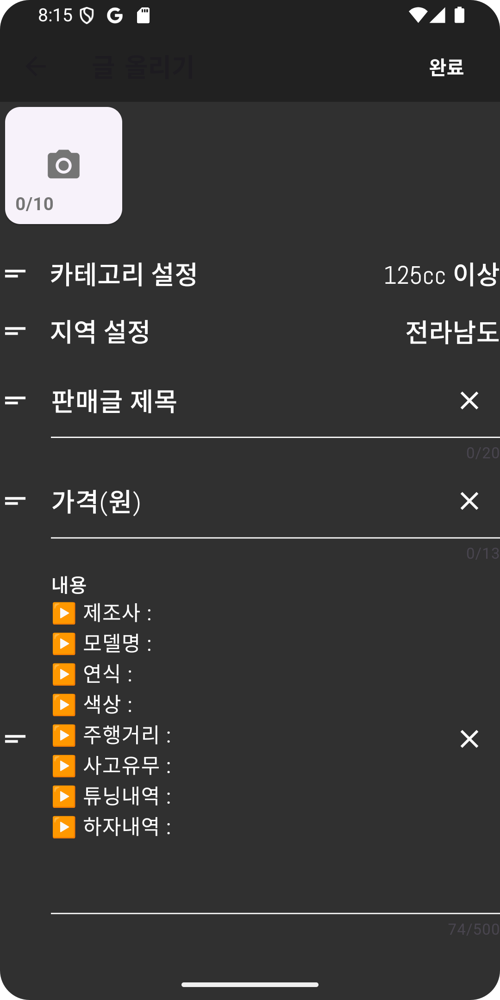
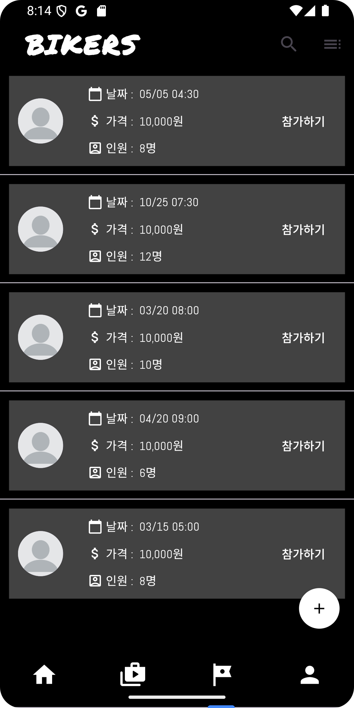
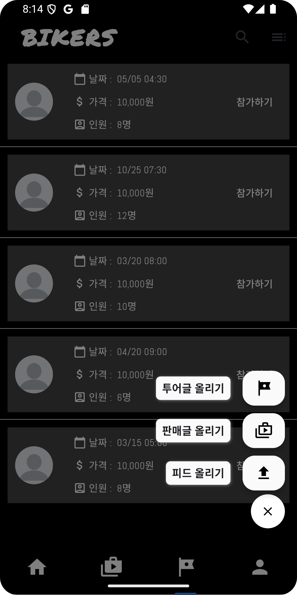
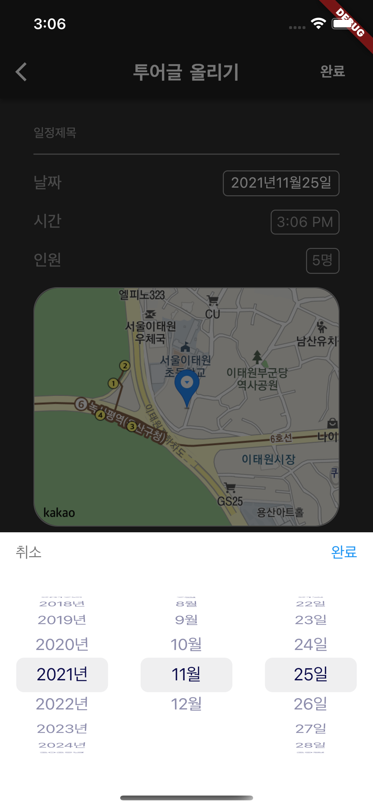

## 🏍 바이크 커뮤니티 앱 개발 프로젝트

### 📝 프로젝트 개요
- **프로젝트 유형**: 2인 프로젝트 (기획 1명, 개발 1명)
- **개발 기간**: 2021.06 ~ 2021.11 (6개월)
- **기여도**: 80%

### 🛠 사용 기술
- Flutter 3.0
- Node.js 16
- Express.js
- Socket.io
- MySQL 8.0
- Firebase Authentication
- Firebase Storage

### 💡 주요 구현 기능
1. 스크롤뷰 성능 최적화
    - 이미지 압축 + 이미지 로컬 캐싱
2. 카카오맵 API 연동
    - WebView 기반 지도 서비스 구현 <- Flask로 HTML 서빙
    - 위치 기반 서비스
3. 실시간 채팅 기능
    - WebSocket 기반

### 구현 화면

|||||
|:---:|:---:|:---:|:---:|
|로그인 화면 Firebase Auth 기반 문자 인증|메인화면 바이크 관련 게시글 피드|상품 화면 중고 거래|상품 상세 화면 중고 거래|
|||||
|상품 등록 화면 중고 거래|투어 모임 모임 게시글 피드|하단 탭 메뉴 홈, 중고거래, 투어모임|투어 모임 등록 화면 카카오맵 API 연동|
